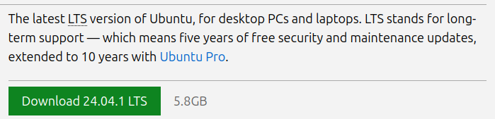
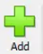

# Hello-World-Microservices

## Table of Contents
- [Introduction](#introduction)
- [Installation and Setting up Environment](#installation-and-setting-up-environment)
- [Run the project](#Run-the-project)
- [License](#license)

## Installation and Setting up Environment

### Install Ubuntu OS

First of all, a Ubuntu OS is needed.

You can either install Ubuntu following the steps on https://ubuntu.com/tutorials/install-ubuntu-desktop#1-overview

Or

You can just create a virtual environment via Oracle VM VirtualBox (Recommanded if your computer is not operating under Ubuntu OS)

To install the Oracle VM VirtualBox, you will need to navigate to https://www.virtualbox.org/wiki/Downloads and click on the package which matches your system's host. The below image is the location expected for picking your platforms


For example, if your host OS is Windows System, you will click on the "Windows hosts", and it will download the Virtual Box Setup "VirtualBox-7.0.20-163906-Win.exe" file.

Then, you will double click on the "VirtualBox-7.0.20-163906-Win.exe" file downloaded and follow the pop up wizard to finish installing the Oracle VM Virtual Box.

Meanwhile, you want to download the .iso file for Ubuntu 24.04.1 LTS setting it up inside Oracle VM Virtual Box.
Navigate to https://ubuntu.com/download/desktop, and click on the "Download 24.04.1 LTS" green button like the image below shown:



After the Oracle VM Virtual Box is installed on your environment and the Ubuntu 24.04.1 LTS .iso file is downloaded, you can follow the following guide to install Ubuntu 24.04.1 LTS on Virtual Box: https://itslinuxguide.com/install-ubuntu-virtualbox/

If you don't want to read that long guide, you can follow these steps:

1. Open Oracle VM Virtual Box you have installed, and click on the green cross button () which have "Add" text under it.
2. On the pop-up wizard,

### Install Necessary Softwares

You should be doing these installation from top to bottom to avoid conflicts. (i.e. You should not install express.js before installing Node.js)

Installing nvm is optional, but it is a better way to manage Node.js versions, which is highly recommanded.

#### Install nvm

You can navigate to https://github.com/nvm-sh/nvm?tab=readme-ov-file#installing-and-updating and follow the steps there.

Or follow these steps:

1. On the Ubuntu terminal, copy and paste in the following cmd and hit Enter key on your keyboard,

```bash
curl -o- https://raw.githubusercontent.com/nvm-sh/nvm/v0.40.1/install.sh | bash
```

2. After the download is completed, copy and paste in the following cmd and hit Enter key on your keyboard,

```bash
export NVM_DIR="$([ -z "${XDG_CONFIG_HOME-}" ] && printf %s "${HOME}/.nvm" || printf %s "${XDG_CONFIG_HOME}/nvm")"
[ -s "$NVM_DIR/nvm.sh" ] && \. "$NVM_DIR/nvm.sh" # This loads nvm
```

3. After installed, close the terminal and open a new termal window. On the new Ubuntu terminal, copy and paste in the following cmd and hit Enter key on your keyboard.

```bash
nvm -version
```

The nvm version should be showing up similar to the image below

#### Install Node.js

By the reference from https://nodejs.org/en/download/package-manager

You can just open a Ubuntu Termial, and then copy and paste in the following command:

```bash
# installs nvm (Node Version Manager)
curl -o- https://raw.githubusercontent.com/nvm-sh/nvm/v0.40.0/install.sh | bash

# download and install Node.js (you may need to restart the terminal)
nvm install 20

# verifies the right Node.js version is in the environment
node -v # should print `v20.17.0`

# verifies the right npm version is in the environment
npm -v # should print `10.8.2`
```

Or if you have installed nvm, you can simply do use the following cmd:

```bash
# install the latest node version and npm version
nvm install --lts
# use the latest node version and npm version
nvm use --lts

# verifies the right Node.js version is in the environment
node -v # should print `v20.17.0`

# verifies the right npm version is in the environment
npm -v # should print `10.8.2`
```

<!-- #### Install npm packages need for this project -->

<!-- Since this project comes with a package.json file, you can just navigate to the project directory and use the below command:

```bash
# to make sure the current terminal using the ndoe and npm version
nvm use --lts
# install the necessary npm packages for this project
npm install
#
``` -->

#### Install docker

By the official docs on https://docs.docker.com/engine/install/ubuntu/ ,

You will need to run the below command on the Ubuntu Terminal:

```bash
# this uninstall all conflicting packages
for pkg in docker.io docker-doc docker-compose docker-compose-v2 podman-docker containerd runc; do sudo apt-get remove $pkg; done
```

After removeing all the conflicting packages, you can follow these steps list on official docs:

1. Set up Docker's apt repository.

```bash
# Add Docker's official GPG key:
sudo apt-get update
sudo apt-get install ca-certificates curl
sudo install -m 0755 -d /etc/apt/keyrings
sudo curl -fsSL https://download.docker.com/linux/ubuntu/gpg -o /etc/apt/keyrings/docker.asc
sudo chmod a+r /etc/apt/keyrings/docker.asc

# Add the repository to Apt sources:
echo \
  "deb [arch=$(dpkg --print-architecture) signed-by=/etc/apt/keyrings/docker.asc] https://download.docker.com/linux/ubuntu \
  $(. /etc/os-release && echo "$VERSION_CODENAME") stable" | \
  sudo tee /etc/apt/sources.list.d/docke
```

2. Install the Docker packages.

```bash
sudo apt-get install docker-ce docker-ce-cli containerd.io docker-buildx-plugin docker-compose-plugin
```

#### Install Minikube

By the reference from https://minikube.sigs.k8s.io/docs/start/?arch=%2Flinux%2Fx86-64%2Fstable%2Fbinary+download ,

You can just run the below command on Ubuntu Terminal:

```bash
curl -LO https://storage.googleapis.com/minikube/releases/latest/minikube-linux-amd64
sudo install minikube-linux-amd64 /usr/local/bin/minikube && rm minikube-linux-amd64
```

#### Install kubectl

By the reference from https://kubernetes.io/docs/tasks/tools/install-kubectl-linux/ ,

You can just run the below command on Ubuntu Terminal:

```bash
curl -LO https://dl.k8s.io/release/v1.31.0/bin/linux/amd64/kubectl
chmod +x kubectl
mkdir -p ~/.local/bin
mv ./kubectl ~/.local/bin/kubectl
```

and then check if it is update to date and working with

```bash
kubectl version --client
```

### Run the project

1. Open a Ubuntu Terminal, start Minikube with the following command:

```bash
minikube start
```

You should see something like

2. Open a new Ubuntu Terminal Tab, cd into the this project directory and run the below command:

```bash
kubectl apply -f hello-deployment.yaml
kubectl apply -f hello-service.yaml
kubectl apply -f world-deployment.yaml
kubectl apply -f world-service.yaml
```

3. Staying on the current Terminal Tab, run the below command to see if the services are up:

```bash
kubectl get services
```

if they are not up, you will see:

if they are up, you will see:

4. If all the services are up, you can run the below command on the current terminal tab:

```bash
chmod +x test.sh
./test.sh
```

and get this as expected output.

You can also access the services by running the below command on the current terminal tab:

```bash
minikube service hello-service
minikube service world-service
```

a window will pop up on your browser for each service.

You will need to add "/hello" on the to see the hello service as the image below shown

You will need to add "/world" on the to see the hello service as the image below shown

docker build -t world-service -f Dockerfile.world .
docker build -t hello-service -f Dockerfile.hello .

docker run -d -p 3001:3001 world-service
docker run -d -p 3002:3000 hello-service

kubectl apply -f hello-deployment.yaml
kubectl apply -f hello-service.yaml
kubectl apply -f world-deployment.yaml
kubectl apply -f world-service.yaml

kubectl delete -f hello-deployment.yaml
kubectl delete -f hello-service.yaml
kubectl delete -f world-deployment.yaml
kubectl delete -f world-service.yaml

kubectl get deployments
kubectl get pods
kubectl get services

docker tag world-service:latest jjliu10/world-service:latest
docker push jjliu10/world-service:latest

docker tag hello-service:latest jjliu10/hello-service:latest
docker push jjliu10/hello-service:latest

kubectl delete services --all
kubectl delete deployments --all

minikube ssh

minikube service hello-service
minikube service world-service

https://hub.docker.com/repositories/jjliu10

chmod +x test.sh

```

```
