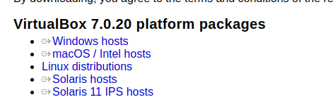
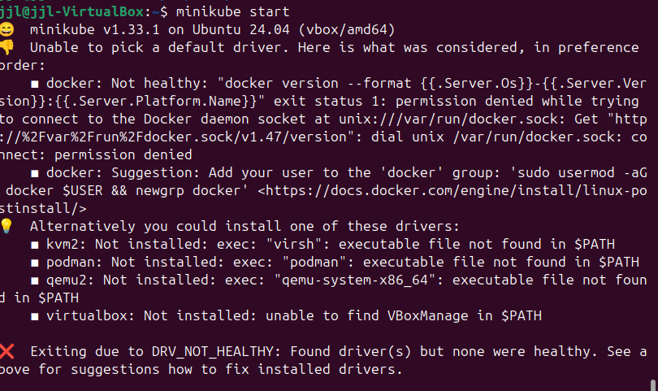

# Hello-World-Microservices

## Table of Contents
- [Introduction](#introduction)
- [Installation and Setting up Environment](#installation-and-setting-up-environment)
- [Run The Project](#run-the-project)
- [License](#license)


## Introduction
This project is a simple Hello World Microservices operated by Minikube with Node.js, and Express.js for the web service. Docker to containerize the 2 services. Minikube for hosting the services.

The docker images used can be found here:

Hello Service image:
 https://hub.docker.com/repository/docker/jjliu10/hello-service/general
World Service image:
 https://hub.docker.com/repository/docker/jjliu10/world-service/general

## Installation and Setting up Environment

### Install Ubuntu OS

First of all, a Ubuntu OS is needed. If you have Ubuntu OS 20.04 and above installed, you can jump to [Install Necessary Softwares](#Install-Necessary-Softwares)

You can either install Ubuntu by following the steps on https://ubuntu.com/tutorials/install-ubuntu-desktop#1-overview

Or

You can create a virtual environment via Oracle VM VirtualBox (Recommended if your computer is not operating under Ubuntu OS)

To install the Oracle VM VirtualBox, you will need to navigate to https://www.virtualbox.org/wiki/Downloads and click on the package that matches your system's host. The below image is the location expected for picking your platforms



For example, if your host OS is Windows System, you will click on the "Windows hosts", and it will download the Virtual Box Setup "VirtualBox-7.0.20-163906-Win.exe" file.

Then, you will double-click on the "VirtualBox-7.0.20-163906-Win.exe" file downloaded and follow the pop-up wizard to finish installing the Oracle VM Virtual Box.

Meanwhile, you want to download the .iso file for Ubuntu 24.04.1 LTS setting it up inside Oracle VM Virtual Box.
Navigate to https://ubuntu.com/download/desktop, and click on the "Download 24.04.1 LTS" green button like the image below:


<mark>Make sure you know where the downloaded .iso file is located, we will need its location for setting up the virtual Ubuntu</mark>

After the Oracle VM Virtual Box is installed on your environment and the Ubuntu 24.04.1 LTS .iso file is downloaded, you can follow the following guide to install Ubuntu 24.04.1 LTS on Virtual Box: https://itslinuxguide.com/install-ubuntu-virtualbox/

If you don't want to read that long guide, you can follow these steps:

1. Open the Oracle VM Virtual Box you have installed, and click on the blue button () which has "New" text under it.
2. On the pop-up wizard, navigate to your designated directory to initialize the virtual Ubuntu. It is recommended to have at least 25GB of disk space. Input the Name for the virtual Ubuntu, for example, it is called "Ubuntu24" here.

3. Click on the ISO Image section, and select the Ubuntu ISO you downloaded earlier:

If you are new to virtual box, you might have to click on "Other" navigate to your ISO file location, and then click on "Open":

4. Click on the "Unattended Install", and change the username and password there. You should memorize or write down the username and password since you will need them when installing packages on Ubuntu.

5. Click on the Hardware, and change base memory to 4096MB and Processors to 4 like this image:

6. Click on the "Finish" button and wait for Virtual Box to prepare the environment. It will automatically launch a window with Ubuntu. Wait for it to initialize until this screen is up:

7. You can now follow the System's instructions to set up the Ubuntu.

### Install Necessary Softwares
The following installation should be done inside the Ubuntu OS.

You should be doing these installations from top to bottom to avoid conflicts. (i.e. You should not install express.js before installing Node.js)

Installing nvm is optional, but it is a better way to manage Node.js versions, which is highly recommended. If you don't want to install nvm, you can jump to - [Install Node.js](#install-nodejs)

#### Install nvm

You can navigate to https://github.com/nvm-sh/nvm?tab=readme-ov-file#installing-and-updating and follow the steps there.

Or follow these steps:

1. On the Ubuntu terminal, copy and paste in the following cmd and hit Enter key on your keyboard,

```bash
curl -o- https://raw.githubusercontent.com/nvm-sh/nvm/v0.40.1/install.sh | bash
```

2. After the download is completed, copy and paste in the following cmd and hit Enter key on your keyboard,

```bash
export NVM_DIR="$([ -z "${XDG_CONFIG_HOME-}" ] && printf %s "${HOME}/.nvm" || printf %s "${XDG_CONFIG_HOME}/nvm")"
[ -s "$NVM_DIR/nvm.sh" ] && \. "$NVM_DIR/nvm.sh" # This loads nvm
```

3. After installation, close the terminal and open a new terminal window. On the new Ubuntu terminal, copy and paste in the following cmd and hit the Enter key on your keyboard.

```bash
nvm --version
```
The nvm version should be showing up similar to the image below


#### Install Node.js

By the reference from https://nodejs.org/en/download/package-manager

You can open a Ubuntu Terminal, and then copy and paste the following command:

```bash
# installs nvm (Node Version Manager)
curl -o- https://raw.githubusercontent.com/nvm-sh/nvm/v0.40.0/install.sh | bash

# download and install Node.js (you may need to restart the terminal)
nvm install 20

# verifies the right Node.js version is in the environment
node -v # should print `v20.17.0`

# verifies the right npm version is in the environment
npm -v # should print `10.8.2`
```

Or if you have installed nvm, you can simply use the following cmd:

```bash
# install the latest node version and npm version
nvm install --lts
# use the latest node version and npm version
nvm use --lts

# verifies the right Node.js version is in the environment
node -v # should print `v20.17.0`

# verifies the right npm version is in the environment
npm -v # should print `10.8.2`
```

After running all the above commands, you should be able to see similar output on the npm -v  and node -v commands like the below image shows:


#### Install docker

According to the official docs on https://docs.docker.com/engine/install/ubuntu/,

You will need to run the below command on the Ubuntu Terminal then enter your password and hit the Enter key if prompted:

```bash
# this uninstall all conflicting packages
for pkg in docker.io docker-doc docker-compose docker-compose-v2 podman-docker containerd runc; do sudo apt-get remove $pkg; done
```

After removing all the conflicting packages, you can follow the steps listed on the official docs:

1. Set up Docker's apt repository.

```bash
# Add Docker's official GPG key:
sudo apt-get update
sudo apt-get install ca-certificates curl
sudo install -m 0755 -d /etc/apt/keyrings
sudo curl -fsSL https://download.docker.com/linux/ubuntu/gpg -o /etc/apt/keyrings/docker.asc
sudo chmod a+r /etc/apt/keyrings/docker.asc

# Add the repository to Apt sources:
echo \
 "deb [arch=$(dpkg --print-architecture) signed-by=/etc/apt/keyrings/docker.asc] https://download.docker.com/linux/ubuntu \
 $(. /etc/os-release && echo "$VERSION_CODENAME") stable" | \
 sudo tee /etc/apt/sources.list.d/docker.list > /dev/null
sudo apt-get update
```

2. Install the Docker packages.

```bash
sudo apt-get install docker-ce docker-ce-cli containerd.io docker-buildx-plugin docker-compose-plugin
```

#### Install Minikube

By the reference from https://minikube.sigs.k8s.io/docs/start/?arch=%2Flinux%2Fx86-64%2Fstable%2Fbinary+download,

You can just run the below command on Ubuntu Terminal:

```bash
curl -LO https://storage.googleapis.com/minikube/releases/latest/minikube-linux-amd64
sudo install minikube-linux-amd64 /usr/local/bin/minikube && rm minikube-linux-amd64
```

#### Install kubectl

By the reference from https://kubernetes.io/docs/tasks/tools/install-kubectl-linux/,

You can just run the below command on Ubuntu Terminal:

```bash
curl -LO https://dl.k8s.io/release/v1.31.0/bin/linux/amd64/kubectl
sudo install -o root -g root -m 0755 kubectl /usr/local/bin/kubectl
chmod +x kubectl
mkdir -p ~/.local/bin
mv ./kubectl ~/.local/bin/kubectl
```

and then check if it is updated to date and working with

```bash
kubectl version --client
```
#### Install this project

You can either just download this project by clicking the green "<> Code" button, and then click on the "Download ZIP" button like the below image shows: 


Then, you will have the zip file named "Hello-World-Microservices-main.zip". Unzip this file and you will have the project downloaded. 

Or 

if you have git installed, you can run the following cmd inside Ubuntu Terminal:

```bash
git clone https://github.com/FoamLeave/Hello-World-Microservices.git
```
If you don't have git installed and still want to use git, you can do the following:

```bash
sudo apt update
sudo apt install git
git config --global user.name "Your Name"
git config --global user.email "your.email@example.com"
```

Replace the "Your Name" and "your.email@example.com" with your git account name and email. If you don't have a git account, please go to https://github.com/signup?ref_cta=Sign+up&ref_loc=header+logged+out&ref_page=%2F&source=header-home and make one following their instructions.


### Run The Project

1. Open a Ubuntu Terminal, start Minikube with the following command:

```bash
minikube start
```

You might see something like the following:


To resolve this, run the below command and input your system password if prompted on the current Ubuntu terminal tab:
```bash
sudo usermod -aG docker $USER && newgrp docker
```

After the above command is executed, run on the current terminal tab again with:
```bash
minikube start
```

You should be able to see: 


2. Open a new Ubuntu Terminal Tab, cd into this project's directory, and run the below command:


```bash
kubectl apply -f hello-deployment.yaml
kubectl apply -f hello-service.yaml
kubectl apply -f world-deployment.yaml
kubectl apply -f world-service.yaml
```

You should see the similar output as below:


3. Staying on the current Terminal Tab, run the below command to see if the services are up:

```bash
kubectl get pods
```

if they are not up, you will see 0/1 under ready like the "world-deployment-5f796d7ccb-rf489" here:


if they are up, you will see:


4. If all the pods are up, you can run the below command on the current terminal tab:

```bash
chmod +x test.sh
./test.sh
```

You might get errors like:


and you should grant minikube access to docker:

```bash
sudo chmod 666 /var/run/docker.sock
sudo usermod -aG docker ${USER}
```
After the above command, you can run ./test.sh again to get this as the expected output:


You can also access the services by running the below command on the current terminal tab:

```bash
minikube service hello-service
```
```bash
minikube service world-service
```
a window will pop up on your browser for each service like:

Hello Service:


You will need to add "/hello" on the URL and hit enter to see the hello service as the image below shows:


World Service:


You will need to add "/world" on the URL and hit enter to see the hello service as the image below shows:


### License
This project is licensed under the GNU General Public [LICENSE](LICENSE)
 v3.0. See the LICENSE file for details.
